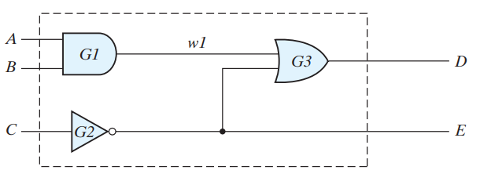
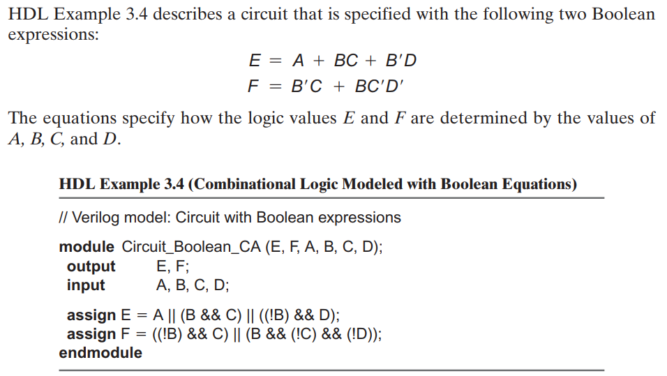

# HARDWARE  DESCRIPTION LANGUAGE (HDL): *VERILOG*

---

---

## Outline:

* HDL: VERILOG
* Active-HDL:
  * Create Workspace
  * Add New Design to Workspace
  * Selecting Default HDL Language: VERILOG
  * Add New File: Verilog Source
* Single line Comment (Like JAVA)
* Multiple Line Comment (Like JAVA)
* What is a **module**?
* **Interface** = port list = parameter list
* Identifier.
* **System primitives = Built-in Gates = Built-in Primitives**.
* Different Coding Styles:
    1- **Gate-level Modeling** = Structural Modeling: Basic Built-in Gates such as **and**, **or**, **not**, **xor**, **nand**, **nor**, **xnor**.
    2- **Continuous Assignment Statements** = Data Flow Modeling: Using logical operators: and ( **&&** ), or ( **||** ), not ( **!** ).
    3- **Behavioral Modeling**.
* User-defined Primitive.
* Test Bench (Test File): Simulation the circuits behavior.
* Active-HDL:
  * Compile / Compile All
  * Library $\Rightarrow$ Test Bench $ \Rightarrow $ Initialize Simulation
  * Test Bench $ \Rightarrow $ Add to Waveform
  * Simultation $ \Rightarrow $ Run
  * Waveform = Timing Diagram (Time & Signal Relationship)
  * End Simulation
    


---
## Basics:

* A **hardware description language (HDL)** is a computer-based language that describes the hardware of digital systems in a textual form.

---

* Programming Languages:
  * **Software rogramming Language:** Java, C++, Python, ... etc.
  * **Hardware Description Language (HDL)**: **Verilog**, VHDL.

---

* **Simulator Software**: Active-HDL Student Edition

    <https://www.aldec.com/en/products/fpga_simulation/active_hdl_student>

---

* Verilog source file extension: **(*.v)**
* **module**: is the basic building block in Verilog.
  * represents digital circuit or design unit.
* **module**: is the fundamental descriptive unit in the **Verilog** language. It is declared by the keyword **module** and must always be terminated by the keyword **endmodule**.
* **VERILOG** is case sensitive.
* **Keywords** are predefined lowercase identifiers that define the language constructs. Examples of keywords are **module**, **endmodule**, **input**, **output**, **wire**, **and**, **or**, and **not**.
* **Identifier** (e.g. moduleName): can contain sequence of letters, digits, and underscore (_).
* **System primitives**: Design units defined by the system.
* One module definition cannot contain another module definition.

---

## Important Notes:

* We don't need to specify a name when using  systme primitive or user-defined primitive.
* We have to specify a name when using user-defined module.

---


* Basic Keywords:
  
| module            |endmodule          | and       |
|----------         |----------         |---------- |
| **input**         | **wire**          |**or**     |
| **output**        | **assign**        |**not**    |
| **primitive**     | **endprimitive**  |**xor**    |
| **table**         | **endtable**      |**nand**   |
| **begin**         | **end**           |**nor**    |
| **initial**       | **reg**           |**xnor**   |
||||


***

#### HDL Example 3.1 (Combinational Logic Modeled with Primitives)



```verilog
// Verilog model of circuit of Figure 3.35. IEEE 1364–1995 Syntax
module Simple_Circuit (A, B, C, D, E);
    output D, E;
    input A, B, C;
    wire w1;

    and G1 (w1, A, B); // Optional gate instance name
    not G2 (E, C);
    or  G3 (D, w1, E);
endmodule
```
---


---
### Figure 3.20 (A)


---
### Files & Tasks

  1- Simple Circuit
  2- Simple Circuit 2
  3- UDP_02467
  4- Test Benches

Tasks:
  - 3.31 (A)
  - 3.32 (B)
  - 3.34
  - 3.39
  
---

